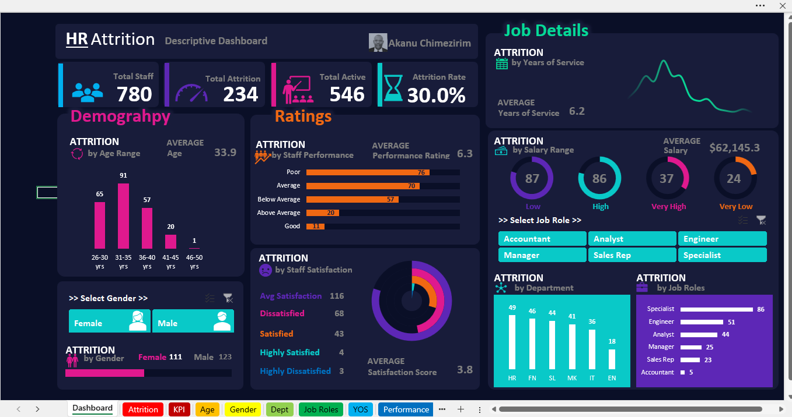

<!--Section 1: Introduce your self-->
## ABOUT ME

 

Hello! I'm Chimezirim Akanu 🤓, the data analyst, educator, and consultant. I specialize in turning raw data into valuable insights that support business strategy and performance. Skilled in using SQL, Python, and Excel for data manipulation across sales, operations, finance, and customer service, I bring a unique perspective to data exploration and visualization. I am committed to using data to solve problems, improve operations, drive innovation and growth.

<!--Mention your top/relevant skills here - core and soft skills-->

 
## WHAT I DO

*As the Data Analyst, I provide consulting and manage projects for businesses with insights from data.*

**- ✅ Data Analytics.**

I provide in-depth analysis and unique solutions to help you make data-driven decisions, optimize processes, and drive business growth. 

**- ✅ Business Analyst.**

I offer consulting services and help businesses make data-driven decision in identifying areas for improvement to enhance operational efficiency.

<!--Section 2: List 3-4 key projects-->
## MY PORTFOLIO 

*A glimpse of some of the projects I've been working on.*

**Unleashing Business Growth with Data: A Journey with Beyond Cars Ltd.**

In today's fast-paced business environment, staying ahead of the curve requires not just intuition but also actionable insights derived from data. Beyond Cars Ltd, a leading car retail company operating across six states in Nigeria, recognized this when they sought to elevate their business growth...

[Read More](https://www.linkedin.com/pulse/unleashing-business-growth-data-journey-beyond-cars-ltd-akanu-qza5f/?trackingId=RFucOKK%2FqFz7Zd83NK8D8w%3D%3D)

**Employee Attrition: Uncovering the Hidden Factors Behind the Exit.**

Employees who felt recognized and engaged were more likely to excel in their roles, while those with lower satisfaction tended to have lower performance metrics..

[Read More](https://www.linkedin.com/pulse/employee-attrition-uncovering-hidden-factors-behind-exit-akanu-fwfjf/?trackingId=8FKd3M4c8HMnV0xj13GLcA%3D%3D)

## CONTACT DETAILS

*Let’s connect and see how we can make a difference together!*
<table>
  <tbody>
    <tr>
      <td>📧</td>
      <td><a href="mailto:akanu.meme@gmail.com">akanu.meme@gmail.com</a></td>
    </tr>
    <tr>
      <td>📞</td>
      <td>(234) 813-847-5934</td>
    </tr>
    <tr>
      <td>📍</td>
      <td>Abuja, Nigeria</td>
    </tr>
    <tr>
      <td>⬇️</td>
      <td><a href="(https://github.com/akanuchime/portfolio/blob/e429ffe50dbdef2292853e3e37394f3f3abb166a/assets/Executive%20Report.pdf)">Download my CV</a></td>
    </tr>
    <tr>
      <td>🌐</td>
      <td><a href="https://www.linkedin.com/in/chimeakanu">The things I do daily on LinkedIn</a></td>
    </tr>
    <tr>
      <td>📺</td>
      <td><a href="https://web.facebook.com/chimeakanu">My activities on the blue app</a></td>
    </tr>
  </tbody>
</table>

